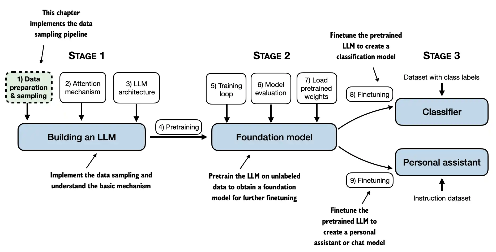

# Train GPT2

## Plan
- Following this [great book on LLMs from scratch by Sebastian Raschka](https://www.manning.com/books/build-a-large-language-model-from-scratch?utm_source=raschka&utm_medium=affiliate&utm_campaign=book_raschka_build_12_12_23&a_aid=raschka&a_bid=4c2437a0&chan=mm_github)
- [The github repo](https://github.com/rasbt/LLMs-from-scratch/tree/main) associated with book
- I aim to implement every line of code by myself and use his book for reference, do buy his book !

## Progress
- [x] Setup pytorch with GPU
- [ ] Read data
- [ ] Define model
    - [ ] Embedding block
    - [ ] Transformer block
        - [ ] Layer Norm block
        - [ ] Multi head attention block
        - [ ] DNN block 
- [ ] Define loss functions
- [ ] Define training / val loop
- [ ] Train / test
    - [ ] Toy dataset
    - [ ] Real dataset